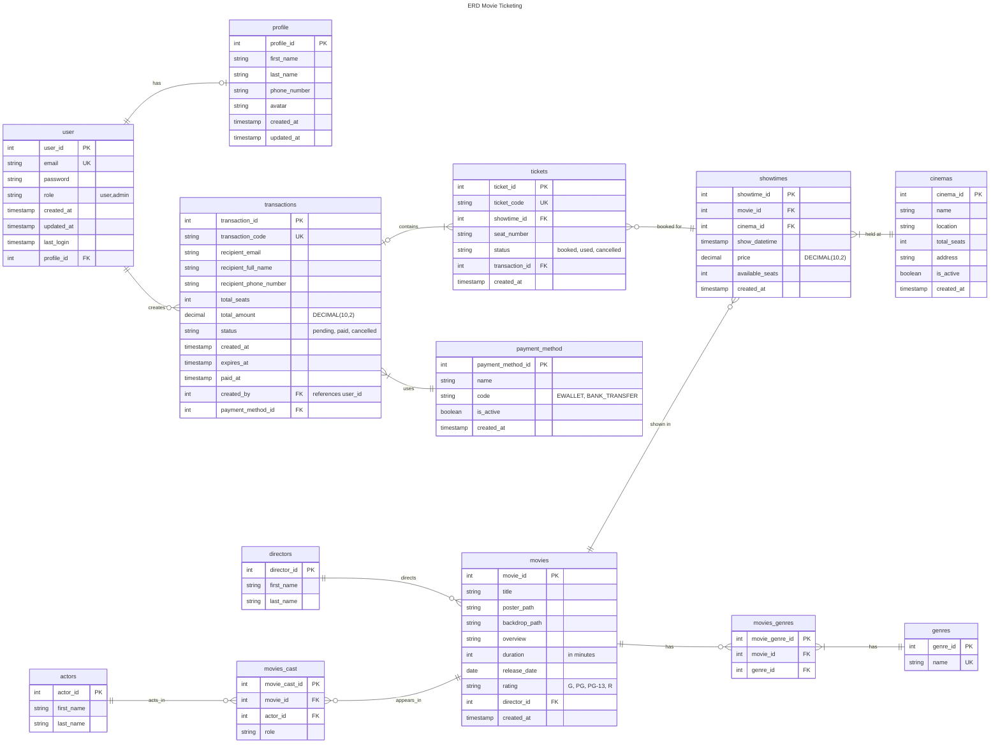

```mermaid

---
title: ERD Movie Ticketing
---
erDiagram
direction LR
    user ||--O|profile : has
    user ||--o{transactions : creates

    tickets }o--||showtimes : "booked for"
    transactions |o--|{tickets : contains
    transactions }|--||payment_method : uses

    movies ||--o{showtimes : "shown in"
    showtimes }|--||cinemas : "held at"

    movies ||--o{movies_genres : has
    directors||--o{movies : directs
    actors ||--o{movies_cast : acts_in
    movies_cast}o--||movies : appears_in
    movies_genres }|--||genres : has

    user{
        int user_id PK
        string email UK
        string password
        string role "user,admin"
        timestamp created_at
        timestamp updated_at
        timestamp last_login
        int profile_id FK
    }

    profile{
        int profile_id PK
        string first_name
        string last_name
        string phone_number
        string avatar
        timestamp created_at
        timestamp updated_at
    }
    
    transactions{
        int transaction_id PK
        string transaction_code UK
        string recipient_email
        string recipient_full_name
        string recipient_phone_number
        int total_seats
        decimal total_amount "DECIMAL(10,2)"
        string status "pending, paid, cancelled"
        timestamp created_at
        timestamp expires_at
        timestamp paid_at
        int created_by FK "references user_id"
        int payment_method_id FK
    }

    tickets{
        int ticket_id PK
        string ticket_code UK
        int showtime_id FK
        string seat_number
        string status "booked, used, cancelled"
        int transaction_id FK
        timestamp created_at
    }

    showtimes{
        int showtime_id PK
        int movie_id FK
        int cinema_id FK
        timestamp show_datetime
        decimal price "DECIMAL(10,2)"
        int available_seats
        timestamp created_at
    }

    cinemas{
        int cinema_id PK
        string name
        string location
        int total_seats
        string address
        boolean is_active
        timestamp created_at
    }

    payment_method{
        int payment_method_id PK
        string name
        string code "EWALLET, BANK_TRANSFER"
        boolean is_active
        timestamp created_at
    }

    movies{
        int movie_id PK
        string title
        string poster_path
        string backdrop_path
        string overview
        int duration "in minutes"
        date release_date
        string rating "G, PG, PG-13, R"
        int director_id FK
        timestamp created_at
    }

    movies_cast{
        int movie_cast_id PK
        int movie_id FK
        int actor_id FK
        string role
    }

    actors{
        int actor_id PK
        string first_name
        string last_name
    }

    movies_genres{
        int movie_genre_id PK
        int movie_id FK
        int genre_id FK
    }

    genres {
        int genre_id PK
        string name UK
    }

    directors{
        int director_id PK
        string first_name
        string last_name
    }
```