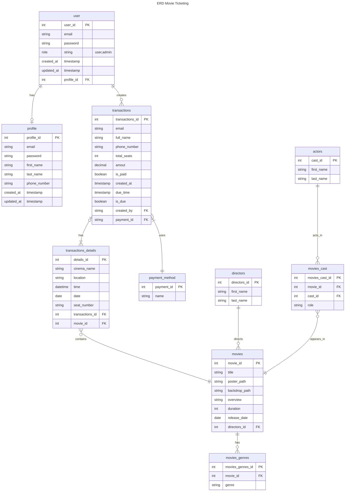

```mermaid

---
title: ERD Movie Ticketing
---
erDiagram
direction TB
    user ||--O|profile : has
    user ||--o{transactions : creates

    transactions_details }o--||movies : contains
    transactions |o--|{transactions_details : has
    transactions }|--||payment_method : uses

    movies ||--o{movies_genres : has
    directors||--o{movies : directs
    actors ||--o{movies_cast : acts_in
    movies_cast}o--||movies : appears_in

    user{
        int user_id PK
        string email
        string password
	role string "user,admin"
	created_at timestamp
	updated_at timestamp
        int profile_id FK
    }

    profile{
        int profile_id PK
        string email
        string password
        string first_name
        string last_name
        string phone_number
	created_at timestamp
	updated_at timestamp
    }
    
    transactions{
        int transactions_id PK
        string email
        string full_name
        string phone_number
        int total_seats
        decimal amout
        boolean is_paid
        timestamp created_at
        timestamp due_time
        boolean is_due
        string created_by FK
        string payment_id FK
    }

    transactions_details{
        int details_id PK
        string cinema_name
        string location
        datetime time
        date date
        string seat_number
        int transactions_id FK
        int movie_id FK
    }

    payment_method{
        int payment_id PK
        string name
    }

    movies{
        int movie_id PK
        string title
        string poster_path
        string backdrop_path
        string overview
        int duration
        date release_date
        int directors_id FK
    }

    movies_cast{
        int movies_cast_id PK
        int movie_id FK
        int cast_id FK
        string role
    }

    actors{
        int cast_id PK
        string first_name
        string last_name
    }

    movies_genres{
        int movies_genres_id PK
        int movie_id FK
        string genre
    }

    directors{
        int directors_id PK
        string first_name
        string last_name
    }

```